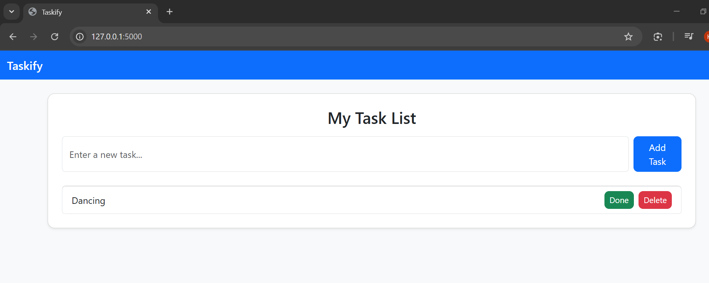

# Taskify – Simple Flask To-Do Web App

## Overview of my project
Taskify is a minimalist Flask-based to-do list application that helps users add, complete, and delete tasks through a simple and clean interface. It automatically initializes its database when first launched, making it easy to run in one step.

## The features 
- Add, mark complete, and delete tasks  
-  SQLite database named (`task.db`)  
- A simple Bootstrap-based responsive UI  
- My appl is lightweight and ready to deploy  

## Technologies i ussed in this project
- Flask – A python micro web framework  
- Flask-SQLAlchemy – ORM for SQLite  
- Bootstrap– Frontend styling for my app
- SQLite – Local database engine for my app

## we start by installing dependencies by runing 
`pip install -r requirements.txt`.

## Then to run my application we use the following command 
`python app.py` 
- and the page is rendered so just visit `http://127.0.0.1:5000` on your browser.

## My app screenshots

### Homepage

### Adding Tasks Page

### Tasks with some done and can also be marked undone or even delete them

